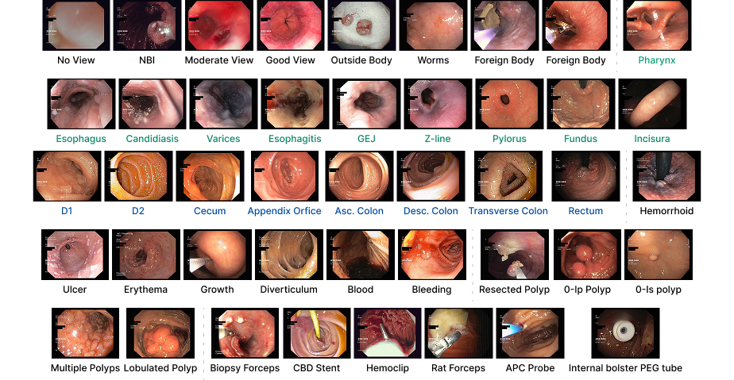
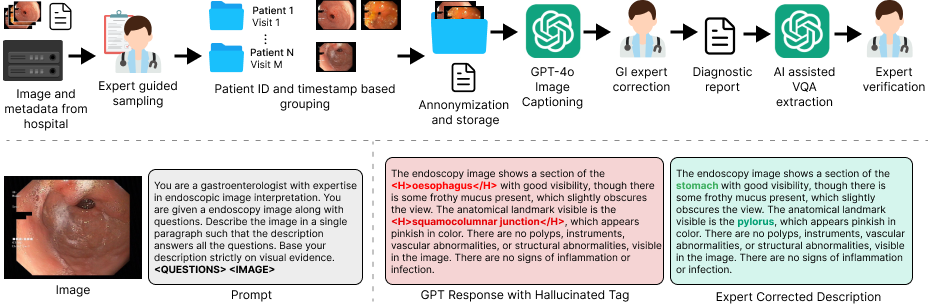

# SAGE - South Asian GI Endoscopy Dataset
[](https://opensource.org/licenses/MIT)

**SAGE** is the first South Asian endoscopy dataset, collected at Dhulikhel Hospital, Nepal. It consists of 1,300 endoscopic images paired with rich, expert-validated annotations, including:

- 1,300 GI expert-annotated image captions
- 14,276 visual question–answer (VQA) pairs
- 18 labels for multi-label classification
- 14 classes for multi-class classification

- Dataset is publicy available at [Synapse SAGE](https://synapse.org/SAGE)




## Usage

### Dataset Curation and Anonymization
1. `filter-near-duplicates.py`, script to filter the near duplicate images
2. `extract-date-from-images.py`, utilizes easyocr to extract the dates
3. `generate-study-id.py`, generates the visit id based on the visit timestamp
4. `standard-dataset-creator.py`, to create datset and in standard format with redaction. Note that the CSV generated from earlier scripts should be used along with an extra column, `redact_bboxes` with redaction bbox information.

### Data Splitting and Multi Class Label Generation
This step requires annotation from GI experts for each image where, the annoation should be a dict with schema;
```python
"sample-id>": {
	"classes": ["class-1", "class-2", "..."]
}
```
Run the script `multiclass-train-test-split.py` that;
1. Creates MultiClass Labels
2. Create train-test split through MultiLabelStratifiedSampling

### Benchmarking Proprietary VLMS
The study used [Open Router](https://openrouter.ai) for accessing the models including `Gemini-3.5-Flash-Preview`, `Gemma-4-31b`, `Grok-4.3`, `Qwen-2.5vl-72b`, and `Claude Sonnet 4.6`. The benchmarking requires key from `OpenRouter` to run the script.

Image captions for each model can be generated using `image-captioning.py` as
```python
python image-captioning.py --name <NAME> --model <MODEL_ID>
```

To convert the caption into six clinically relevant tasks, run the script
```python
python extract-vqa.py --name <NAME> --input-json <NAME> --mini
```

Then Green model was run for each model outputs to compute the average green score for all the models in both the dataset.

After GREEN score is computed, use `benchmarking.py` for aggregating the results.

### Others
- `interrater-disagreement.py`, to compute the interrater disagreement among the annotators
- `hyperkvasir-on-SAGE.py`, benchmarking models trained on european dataset in our dataset
- `trainer.py`, script to train ResNet and DenseNet for HyperKvasir and SAGE
